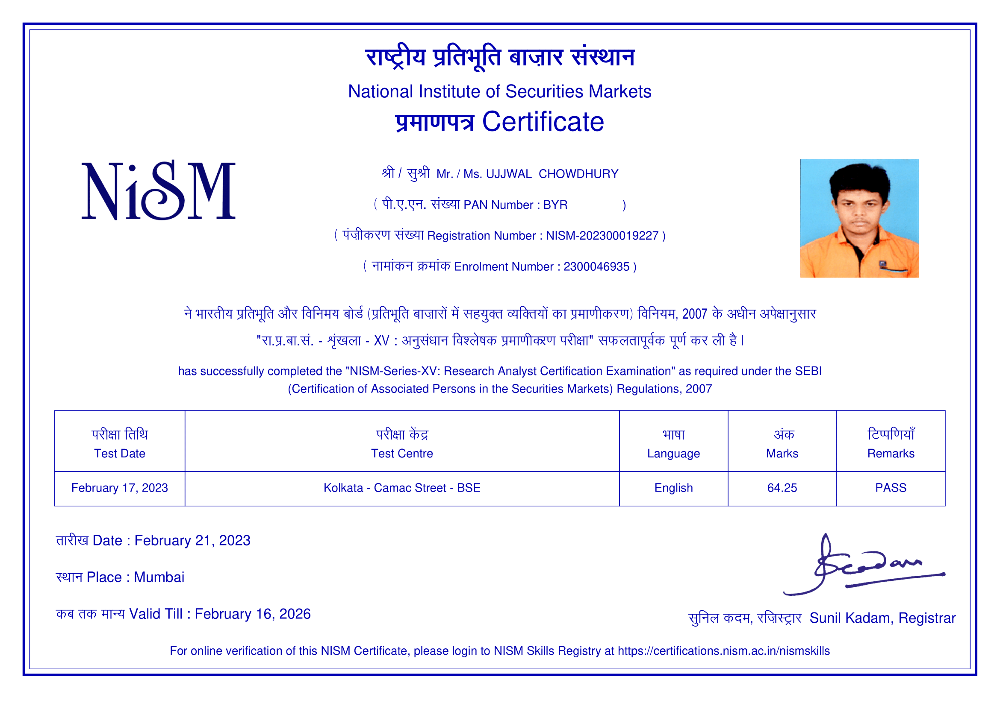
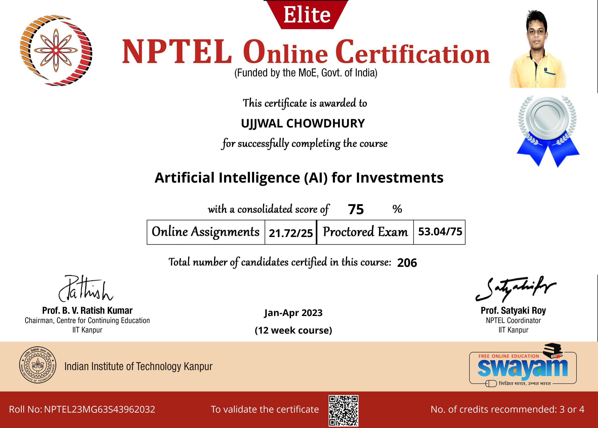
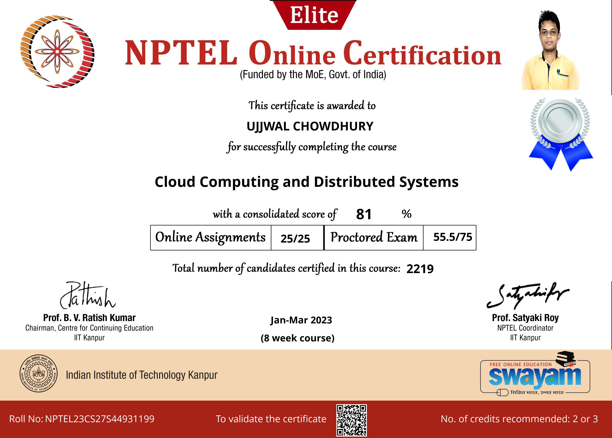
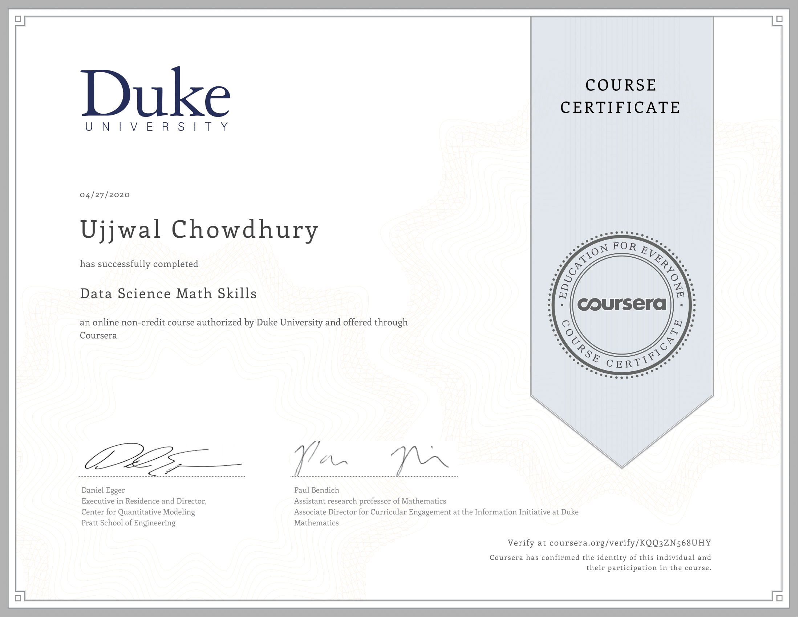

# [NISM-Series-XV: Research Analyst](https://www.nism.ac.in/research-analyst-certification-examination/)
Completing the NISM Series XV Research Analyst examination equipped me with foundational knowledge of the **Indian Securities Markets** and essential terminologies used in **Equity** and **Debt Markets**. I learned diverse **Research Methodologies**, including top-down and bottom-up approaches, facilitating comprehensive analysis. Additionally, I honed skills in **Economic Analysis**, **Industry and Company Evaluation**, **Risk Management**, **Valuation** principles, and effective communication through research **Report Writing**.

## Skills Learned:
**Micro and Macro-economic Analysis**, **Fundamental Analysis**, **Industry Analysis**, **Company Analysis**, **KPI Analysis**.

# [Artificial Intelligence (AI) for Investments](https://onlinecourses.nptel.ac.in/noc23_mg63/preview)
This program aims to prepare professionals in the finance industry and related fields for the transformative impact of machine learning (ML) and AI. It covers a comprehensive curriculum designed to equip participants with the knowledge and skills necessary to leverage AI and ML techniques in financial markets, trading, and asset management. From understanding **financial markets** and **risk-return analysis** to advanced **time-series** algorithms for risk management, the course provides practical insights and tools for improving investment decisions using AI-based models.
## Skills Learned:
**Portfolio Optimization**, **CAPM**, **Algorithmic Trading**, **ARMA**, **ARIMA**, **ARCH**, **GARCH**, **3-Factor Fama-French Model**.

# [Cloud Computing and Distributed Systems](https://onlinecourses.nptel.ac.in/noc23_cs27/preview)
In the course, I learned about **Cloud Computing** fundamentals, including **virtualization techniques** such as bare metal and **hosted hypervisor models**, and the benefits and types of virtualization. Additionally, I gained insights into **network virtualization** methods, software-defined networking, and inter-data center networking in geo-distributed cloud environments. Furthermore, the course covered topics like leader **election algorithms**, distributed mutual exclusion, consensus mechanisms like **Paxos**, recovery approaches in distributed systems, and the design and operation of key-value stores, along with discussions on **P2P** systems and cloud applications like **MapReduce**, **Spark**, and **Apache Kafka**.

## Skills Learned:
**Virtual Machines**, **Distributed Systems**, **NoSQL**, **MapReduce**, **PySpark**, **Apache Kafka**.

# [Data Base Management System](https://onlinecourses.nptel.ac.in/noc22_cs91/preview)
The course on Databases provides a comprehensive understanding of Structured Database Management Systems (**DBMS**) and their significance in various applications, covering both commercial systems like Oracle and open-source solutions such as **MySQL**. It delves into data structures, file organizations, SQL, data analysis, database design, and optimization, facilitating proficiency in relational data models, entity-relationship modeling, and query coding practices. Additionally, the course explores multi-tier client/server architectures, web-based database applications, and advanced topics including indexing, hashing, concurrency control, and recovery systems across its eight-week layout.

## Skills Learned:
**RDBMS**, **SQL**, **Indexing**, **Hashing**, **Query Optimization**, **window function**.

# [Deep Learning for Computer Vision](https://onlinecourses.nptel.ac.in/noc21_cs93/preview)
This course on Computer Vision begins with an overview of image and video analysis, emphasizing its applications in security, healthcare, entertainment, and mobility. It covers traditional computer vision topics and progresses to deep learning methods, assuming prior knowledge of machine learning. The curriculum includes a comprehensive exploration of visual features, matching techniques, deep learning fundamentals, CNN architectures, RNNs, attention models, generative models, and their applications in real-world scenarios over twelve weeks.

## Skills Learned:
**Classical CV**, **Multi-layer Perceptrons**, **Backpropagation**, **CNN**, **RNN**, **AlexNet**, **VGG**, **ResNets**, **U-Net**, **VAE**, **GAN**, **Zero-shot, One-shot, Few-shot Learning**.

# [Data Science Math Skills](https://www.coursera.org/learn/datasciencemathskills)
This data science course focuses on essential math skills crucial for success in data science, catering to learners with basic math proficiency who may not have studied algebra or pre-calculus. It systematically introduces core mathematical concepts without overwhelming complexity, ensuring learners grasp each idea and math symbol gradually. Upon completion, students will have mastered fundamental vocabulary, notation, concepts, and algebraic rules necessary for advanced data science studies. Topics covered include set theory, properties of real numbers, interval notation, summation, Cartesian plane math, functions and inverses, instantaneous rate of change, exponents, logarithms, and **probability theory**, including **Bayes’ theorem**.

## Skills Learned:
**Probability**, **Bayes Theory**, **Set Theory**, **Linear Algebra**, **Calculus**.

